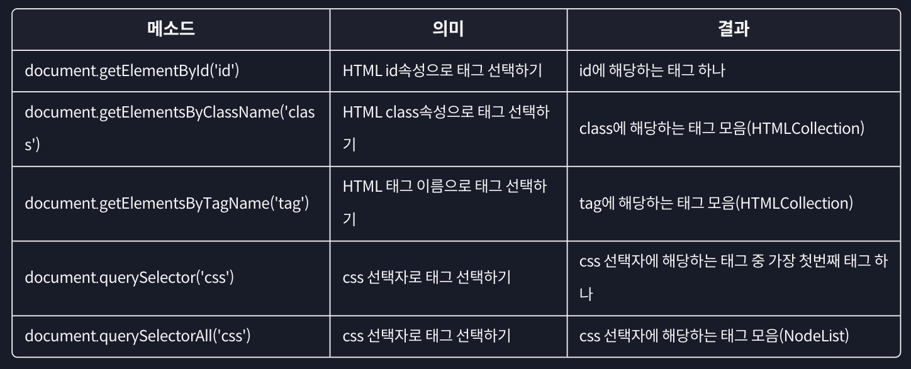

# 인터랙티브 자바스크립트

### id로 태그 선택하기

```jsx
document.getElementById("$idName");

// <div id="myNumber">{content}</div>
```

⇒ 해당 태그 내부의 다른 코드들도 보여줌. ID는 하나만 부여 가능하므로 특정 태그를 불러올 수 있음.

### class로 태그 선택하기

```jsx
document.getElementsByClassName("$className");

// HTMLCollection 객체: 배열 메소드는 사용할 수는 없지만, length 프로퍼티나 인덱스는 사용 가능.
```

유사 배열(`Array-Like Object`) → `for of 문`도 사용 가능. `isArray` 사욛 시 `false` 반환함.

위에서부터 깊이에 관계없이 순서대로 반환홤. 요소가 하나밖에 없어서 배열처럼 반환되므로 0번 인덱스로 접근해야 함.

⇒ 해당하는 요소가 없어도 빈 객체가 반환됨.

### CSS 선택자로 태그 선택하기

```jsx
document.querySelector("$selector");
// <div /*selector*/>{content}</div>

document.querySelectorAll("$selector");
// nodeList 객체: className처럼 반환함.
```



## DOM

- `window` 객체 - 전역 객체
  [Window - Web API | MDN](https://developer.mozilla.org/ko/docs/Web/API/Window)
- 문서 객체 모델(Document Object Model)
  DOM 노드의 종류
  [DOM Standard](https://dom.spec.whatwg.org/#node)

`**console.dir**`

- 출력하는 자료형이 다름. dir은 문자열 표시 형식으로 콘솔에 출력함.
- `log`는 전달받은 값 자체, `dir`은 객체의 속성에 초점을 둠.
- `log`는 여러 값을 전달받으면 모두 출력하지만, `dir`은 첫 번째 값만 출력함.
- DOM 객체를 다룰 때, `log`는 HTML형태로 출력하지만, `dir`은 객체 형태로 출력함.

```jsx
// 형제 요소 노드
$dom.previousElementSibling;
$dom.nextElementSibling;

// 부모 요소 노드
$dom.parentElement;

// 자식 요소 노드
$dom.children[0];
$dom.firstElementChild;
$dom.lastElementChild;
```


### 요소 노드 프로퍼티

```jsx
$dom.innerHTML;
// 요소를 HTML 형식으로 접근할 때 사용. 문자열처럼 다룰 수 있으며 직접 요소를 수정할 때 쓰임. 들여쓰기도 그대로 출력됨.

$dom.outerHTML;
// 거의 비슷하지만 해당 요소 전체를 포함하도록 반환함. 새로 값을 할당하면 원래 값이 사라질수도.

$dom.textContent;
// HTML을 제외한 텍스트만 반환함. 요소 안의 값을 수정할 수 있음. HTML처럼 작성해도 그냥 텍스트로 처리됨.
```

- 요소 노드 추가하기

기존 `innerHTML`만을 사용하기에는 코드가 복잡하고 무리가 있음.

```jsx
// 1. 요소 노드 만들기
$dom.createElement("$tagName");

// 2. 요소 노드 꾸미기 (innerHTML 등...)
$dom.textContent = "GDSC";

// 3. 요소 노드 추가하기
$dom.prepend(/*해당 요소 안에 가장 처음에 추가함.*/);
$dom.append(/*해당 요소 안에 가장 뒤에 추가함.*/);

$dom.before(/*해당 요소 앞에 추가함.*/);
$dom.after(/*해당 요소 뒤에 추가함.*/);
```

- 요소 삭제/이동

```jsx
$dom.remove(); // 해당 노드를 삭제함.
// 앞서 사용한 추가 메소드를 이용하여 이동시킴.
```

### HTML 속성

```jsx
// 1. 속성에 접근
element.getAttribute("$attributeName");

// 2. 속성 추가, 수정하기
element.setAttribute("$attributeName", "$value");

// 3. 속성 삭제하기
element.removeAttribute("$attributeName");
```

HTML 표준 속성은 모두 소문자이므로 대소문자를 구분하지 않음.

- 자바스크립트에서 스타일 다루기

```jsx
// style 프로퍼티
~~element.style.{CSS property in camelCase} = '$value';~~
// 권장되지 않음.

// 클래스 이름을 통한 스타일 변경
element.className = '$newName';
// 이러면 클래스 이름이 변경되버림.

element.classList.add/remove/toggle('$className');
// 여러 클래스를 인자로 전달하려면 그냥 컴마로 이어붙임.
```

## 이벤트 핸들러

```jsx
**element.addEventListener('$event', $function);**
// 한 이벤트에 핸들러를 추가함. 가장 권장되는 방식.

element.removeEventListener('$event', $function);
```

- 이벤트 종류
  
  
  
  
  
  

### 이벤트 프로퍼티

이벤트 핸들러에 이벤트 객체를 인자로 받는 핸들러를 추가함.

→ 주로 `target`이나 `type` 프로퍼티를 이용함.

- 프로퍼티 종류

  

  - 마우스 이벤트 프로퍼티

  

  - 키보드 이벤트 프로퍼티

  

- **이벤트 버블링: `stopPropagation()`**

하위 요소에서 발생한 이벤트가 상위 요소로 감에 따라 이벤트 핸들러를 작동 시키는 경우.

- **이벤트 위임(Event Delegation)**

부모 요소에 이벤트를 추가하여 자식 요소의 변화에 관계없이 같은 이벤트가 수행될 수 있도록 함.

→ 부모 요소에서도 이벤트가 수행되지 않게 할려면 조건문을 통해 걸러내는 작업이 필요함.

`tagName`은 해당 요소의 태그를 ‘`**대문자**`’로 갖는 프로퍼티.

```jsx
**classList.contains(’$className’)**
// 인자로 전달받은 값이 해당 요소의 클래스 리스트에 존재하는 지를 확인함. **bool**값 반환
```

⇒ 원하는 자식 요소에서 행동을 할 수 있도록 처리를 해줘야 함.

**버블링을 이용한 방식**이기 때문에 자식 요소 중에 정지되는 경우가 있을 수 있음 → 웬만해선 `stopPropagation()`은 사용하지 않는 쪽으로 해야 함.

### 브라우저

브라우저가 기본적으로 수행하는 동작이 있음(우클릭, 드래그 시 색 변함 등등.)

```jsx
event.preventDefault();
// 우클릭 등의 기본 동작을 막을 수 있음. 꼭 필요한 기능인지 다시 한 번 생각하고..
```

# 마우스 이벤트

```jsx
MouseEvent.button(
  /*
0: 마우스 왼쪽 버튼
1: 마우스 휠
2: 마우스 오른쪽 버튼
*/
  event.button === $value
);

MouseEvent.type(
  /*
click: 마우스 왼쪽 버튼을 누를 때
contextmenu: 마우스 오른쪽 버튼을 누를 때
dbclick: 동일한 위치에서 빠르게 두 번 click할 때

mousedown: 마우스 버튼을 누른 순간
mouseup: 마우스 버튼을 눌렀다 뗀 순간
*/
  event.type === $value
);
```

- 마우스 이동 이벤트

```jsx
MouseEvent.type;
/*
mousemove: 마우스 포인터가 이동할 때
mouseover: 마우스 포인터가 요소 밖에서 안으로 이동할 때
mouseout: 마우스 포인터가 요소 안에서 밖으로 이동할 때
*/

MouseEvent.clientX, clientY;
//: 화면에 표시되는 **창 기준** 마우스 포인터 위치

MouseEvent.pageX, pageY;
//: 웹 문서 **전체 기준** 마우스 포인터 위치

MouseEvent.offsetX, offsetY;
//: 이벤트가 발생한 **요소 기준** 마우스 포인터 위치
```


```jsx
MouseEvent.relatedTarget;
//: 이벤트가 발생하기 직전에 마우스가 위치해있던 요소
// mouseover, mouseout 과 같은 이벤트에서 시작 지점과 끝 지점을 알 수 있음.
```

- `mouseenter`, `mouseleave`
  1. 버블링이 일어나지 않음.
  2. 자식 요소의 영역을 계산하지 않음

`**data-***` 꼴의 속성을 이용할 경우: `dataset.*`을 통해 접근함.

## 키보드 이벤트

```jsx
KeyBoardEvent.type;
/*
keydown: 키보드 버튼을 누른 순간
keypress: 키보드 버튼을 누른 순간 (스페이스바 등 기능적인 키에서는 작동 안 함.)
keyup: 키보드 버튼을 눌렀다 뗀 순간
*/

KeyBoardEvent.key;
//: 이벤트가 발생한 버튼의 값

KeyBoardEvent.code;
//: 이벤트가 발생한 버튼의 키보드에서 물리적인 위치
```

### input 태그

```jsx
/*
focusin(focus): 요소에 포커스가 되었을 때
focusout(blur): 요소에 포커스가 빠져나갈 때
*/
// input 태그인 요소를 눌렀을 때 테두리가 강조됨.

/*
input: 사용자가 입력을 할 때
	(ESC나 Shift 등은 반응 안 함.)
change: 요소의 값이 변했을 때
	(입력이 끝났을 때 원래 상태와 비교함.)
*/
```

- 퀴즈 모범 답안 - **`dataset 사용`**

  ```jsx
  const word = document.querySelector(`**[data-word="${input.value}"]**`);
  ```

- 스크롤 이벤트

보통 `window` 객체에 이벤트를 등록함. - `window` 객체의 프로퍼티가 주로 활용됨.

⇒ 스크롤 방향에 따라 다른 이벤트가 작동하도록 할 수 있음.
