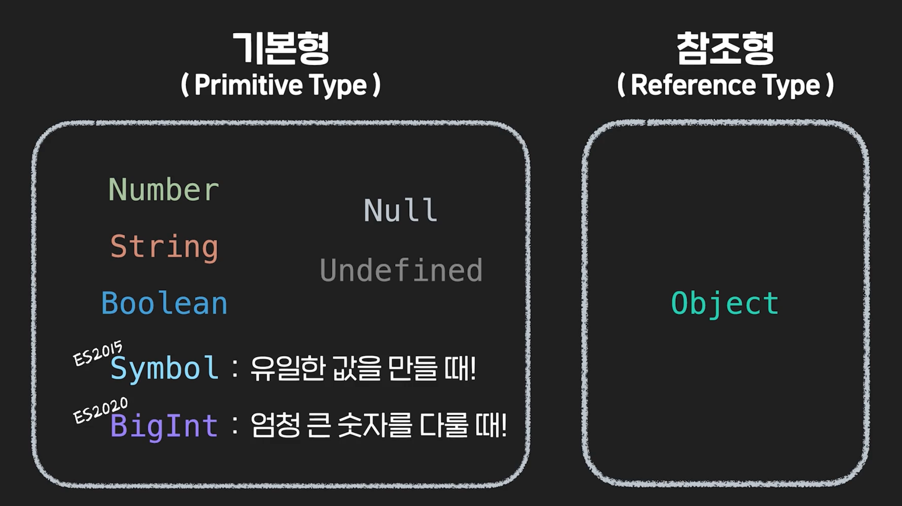

# 모던 자바스크립트

`**ECMAScript**`: 자바스크립트의 표본. ECMA(국제 표준화 기구)에서 지정.

ES6 - 문제를 해결하고 더 안전하고, 간결하게 코드를 작성할 수 있도록 함.

⇒ 브라우저가 지원하는 버전은 다름.

⇒ 현시점에 사용하기 적합한 범위 내에서 최신 버전의 표준을 준수하는 것이 `**모던 자바스크립트**`

---

## 데이터 타입



- `**Symbol**`: 유일한 값을 가진 변수 이름을 만들 대 사용.

```jsx
const symbolA = Symbol("this is Symbol");
const symbolB = Symbol("this is Symbol");

console.log(symbolA === symbolB); // false
```

- `**BigInt**`

```jsx
console.log(9007199254740993n); // 9007199254740993n
console.log(BigInt(9007199254740993)); // 9007199254740993
```

- `False`로 평가되는 값들(**Falsy**): `false`, `null`, `undefined`, `NaN`, `0`, `‘’`

→ 나머지 값들은 `True`로 평가됨.(**Truthy**)

- AND와 OR의 연산 방식

```jsx
function print(value) {
  const message = value || "CodeIt";

  console.log(message);
} // value 값이 없으면 뒤를, 있으면 그 값을 반환함.
```

**AND 연산자**가 OR 연산자보다 우선 순위가 높음.

### null 병합 연산자 `??`

```jsx
const example1 = null ?? "I";
const example2 = undefined ?? "love";
const example3 = "Codeit" ?? "JavaScript";

console.log(example1, example2, example3); // I love Codeit
```

왼편의 값이 `null`/`undefined`면 오른편의 값을 반환하고, 아니면 왼편의 값을 반환함.

→ 다른 falsy 값에 대해서도 동일하게 적용하려면 OR 연산자를 이용.

`var`와 `let`의 차이: 호이스팅(Hoisting), 중복 선언, 스코프(`var`는 함수 단위로만 구분되므로 조건문에서 사용시 그대로 가져옴.)

→ `let`/`const`는 블록 스코프

---

# 함수

- **함수 선언**: 기본 `function` 키워드로 선언함. → 선언보다 먼저 사용 가능함.(호이스팅) **함수 스코프**
- **함수 표현식**: 변수의 값으로 함수를 할당함. (콜백 함수도 동일함.) **블록 스코프**

재귀 함수를 이용할 때는 함수 표현식과 함수 선언을 혼용하여 사용해야 함. → 함수 밖에서는 표현식, 함수 내부에서는 선언할 때 지정한 이름으로 접근.

**즉시 실행 함수**: 바로 실행시킬 수 있으나, 외부에서 재사용이 불가능함.

→ 주로 프로그램 초기화 기능에 많이 활용됨. 리턴값을 바로 변수로 할당할때.

**고차 함수**: 함수를 반환하는 함수. 이중 괄호를 통해서도 접근 가능. ⇒ **일급 함수**를 가진 프로그래밍 언어

파라미터(Parameter): 함수 선언식에서 값으로 이용하기 위해 받는 값.

아규먼트(Argument): 함수를 호출할때 인자로 넣어주는 값.

→ 보통 기본값이 있는 파라미터는 나중에 작성. 함수를 호출할때 아규먼트에 값을 넣을 때 앞에서부터 들어가므로.

⇒ 값에 `undefined`가 들어갈 때도 기본값이 이용됨.

앞에 먼저 정의된 파라미터를 이용할 수도 있음.

- `Argument` 개수에 관계 없이 함수를 이용 → `**arguments**` 유사 배열을 통해 유연하게 동작할 수 있도록 함.
- **`Rest Parameter`**: 인자를 `...`을 통해 입력받아 배열로 이용할 수 있음. → 일반 파라미터와 사용할 때는 마지막에 이용함.

```jsx
function func(first, second, **...others**) { ... }
```

- **Arrow Function:** 익명 함수. `arguments` 객체를 사용할 수 없음.

1. 파라미터가 하나일 경우, 괄호를 생략할 수 있음.
2. 리턴문 하나로만 구성된 경우, 중괄호를 생략할 수 있음.
3. 리턴문이 객체인 경우, 소괄호로 한 번 감싸거나 해야 함.

- `**this**`

기본값은 `window` 객체. 함수를 호출한 객체를 가리키는 키워드.

어떤 객체의 메소드인 경우, 해당 객체를 출력함.

화살표 함수는 함수가 선언되기 직전의 `this`값을 반환함. 이 경우에는 화살표 함수를 이용하면 안됨.

---

문장(statements): 어떤 동작이 일어나도록 작성된 최소한의 코드 덩어리

표현식(expressions): 결과적으로 하나의 값이 되는 모든 코드

- 조건 연산자(삼항 연산자)

```jsx
조건 ? truthy할 때 표현식 : falsy할 때 표현식
```

조건문이나 반복문 등은 표현식에 들어갈 수 없으므로 모든 `if`문을 대체하지는 않음.

### `spread` 연산자

여러 개의 값을 묶은 배열을 개별로 하나씩 반환시킴.

객체 - 주소값이 참조되는 방식. → `spread` 구문을 이용하면 복사할 수 있음.

배열을 펼쳐서 각각의 아규먼트로 사용할 수도 있음. 하나의 값으로 평가되는 것이 아닌 여러 값으로 평가됨.

→ 배열을 펼쳐서는 새로운 배열을 만들거나 함수 아규먼트로 사용할 수 없음.

- **객체 프로퍼티**

변수의 이름과 프로퍼티가 같을 경우, 이를 생략할 수 있음.

객체 내부에서 메소드를 선언할 때, `:`(콜론)과 `function` 키워드를 생략할 수 있음.

대괄호를 통해 프로퍼티 이름을 표현식으로도 작성할 수 있음. 프로퍼티를 구분할 때는 `,`(콤마)

```jsx
...
	['이'+'혁']: '이혁'
}
```

- 옵셔널 체이닝

객체 내부에 있는 객체에 접근함.

```jsx
function printCatName(user) {
  console.log(user.cat?.name);
}
```

해당 객체에 없는 프로퍼티 객체인 경우 에러가 발생하므로, 객체가 있을 경우에만 실행함.

### **구조 분해**

- 배열

할당 연산자 왼편에 변수의 이름이 배열로 선언됨. 배열의 값들이 순서대로 할당됨.

```jsx
const [macbook, ipad, airpods, coupon] = rank;
```

가장 마지막 변수에 spread 연산자를 통해 나머지 값들을 받아올 수 있음.

```jsx
[macbook, ipad] = [ipad, macbook];
```

이를 이용하여 두 값을 바꾸는 코드도 작성할 수 있음.

- 객체

객체를 분해할 때는 중괄호로, 프로퍼티 이름을 통해 분해함.

⇒ 프로퍼티 이름을 새롭게 지정해주기 위해서는?

```jsx
const { $oldName: $newName, ...rest } = obj;
```

함수에서 파라미터로 객체나 배열을 받을 때에도 인자로 그냥 구조분해해서 전달하면 됨.

```jsx
function Name ({...}) {...};
function Name ([...]) {...};
```

⇒ 중첩 객체 구조 분해?

## 에러

에러 객체: `name`, `message`

`ReferenceError`, `TypeError`, `SyntaxError`(실행 전에 중지됨)

```jsx
const error = new TypeError("타입에러가 발생했습니다.");
throw error; // 의도적으로 에러를 발생시킴
```

### 에러 처리

`try-catch`문을 통해 에러 발생 시 코드가 실행되게 함.

```jsx
try {
  // 코드
} catch (errorObj) {
  // console.error(errorObj);
}
```

각각 코드 블럭이므로 블럭 스코프를 다룰 때에는 조심해야 함.

- `finally`문: 위 예외처리문 이후에 최종적으로 실행될 코드(에러 여부와 상관없이)

---

## 배열 메소드

- **`forEach`** 메소드
  - 배열의 각 요소를 콜백함수의 파라미터로 전달하여 수행함.
  ```jsx
  array.forEach((element, index, array) => {...})
  ```
  두 번째 파라미터는 인덱스, 세 번째는 원래 배열을 전달함.(배열 그 자체에 메소드를 사용할 때 주로 씀.)
- `**map**` 메소드
  - `forEach`와 비슷하지만, 리턴값을 모아 하나의 배열로 반환함.
  ```jsx
  const newArray = oldArray.map((element, index) => { return ...})
  ```
- **`filter`** 메소드
  - 특별 조건을 만족하는 요소들만 추려서 새로운 배열을 반환함.
  ```jsx
  const newArray = oldArray.filter((element, index) => {...})
  ```
  `find` 메소드는 값으로 반환함. `find`는 찾는 순간 바로 종료되고 해당 인덱스를 반환함. 따라서 반복횟수가 달라질 수 있음. 없는 값은 `undefined`.
- **`some`**, `**every**` 메소드

  - 조건을 만족하는 요소가 하나라도 있는지, 모두 만족하는지

  ```jsx
  array.some((elm) => /*조건*/)
  array.every((elm) => /*조건*/)

  // bool값을 반환함.
  ```

  반복하는 방식이 `find`와 유사함. 조건 만족 여부에 따라 반복을 종료하기도.
  만약 빈 배열`[]`일 경우, `some: **false**, every: **true**`를 반환함.

- `**reduce**` 메소드
  ```jsx
  array.reduce((**accumulator**, elm, index, arr) => {return ...}, initValue)
  ```
  직전의 결과를 반환받아 새로운 인자로 이용하여 콜백함수를 시행함. 마지막 콜백함수의 값이 전체 함수의 반환값.
  시작값은 없어도 되지만, 그러면 1번 인덱스부터 반복이 시작됨.
- `**sort, reverse**` 메소드

  기존 유니코드 형식으로 정렬되므로, 숫자를 정렬할 때도 원하는대로 안됨 → 인자로 비교 함수를 전달해줘야 함.

  ```jsx
  numbers.sort((a, b) => a - b); // 뺀 값을 반환하므로 오름차순으로 정리됨.
  ```

- `Map` 객체, `Set` 참고 자료
- **`Map`**

  ```jsx
  // Map 생성
  const codeit = new Map();

  // set 메소드
  codeit.set("title", "문자열 key");
  codeit.set(2017, "숫자형 key");
  codeit.set(true, "불린형 key");

  // get 메소드
  console.log(codeit.get(2017)); // 숫자형 key
  console.log(codeit.get(true)); // 불린형 key
  console.log(codeit.get("title")); // 문자열 key

  // has 메소드
  console.log(codeit.has("title")); // true
  console.log(codeit.has("name")); // false

  // size 프로퍼티
  console.log(codeit.size); // 3

  // delete 메소드
  codeit.delete(true);
  console.log(codeit.get(true)); // undefined
  console.log(codeit.size); // 2

  // clear 메소드
  codeit.clear();
  console.log(codeit.get(2017)); // undefined
  console.log(codeit.size); // 0
  ```

- `**Set**`

  ```jsx
  // Set 생성
  const members = new Set();

  // add 메소드
  members.add('영훈'); // Set(1) {"영훈"}
  members.add('윤수'); // Set(2) {"영훈", "윤수"}
  members.add('동욱'); // Set(3) {"영훈", "윤수", "동욱"}
  members.add('태호'); // Set(4) {"영훈", "윤수", "동욱", "태호"}

  // has 메소드
  console.log(members.has('동욱')); // true
  console.log(members.has('현승')); // false

  // size 프로퍼티
  console.log(members.size); // 4

  // delete 메소드
  members.delete('종훈'); // false
  console.log(members.size); // 4
  members.delete('태호'); // true
  console.log(members.size); // 3

  // clear 메소드
  members.clear();
  console.log(members.size); // 0

  ---
  // 배열의 중복된 값을 제거하기 위해 Set 사용.
  const numbers = [1, 3, 4, 3, 3, 3, 2, 1, 1, 1, 5, 5, 3, 2, 1, 4];
  const uniqNumbers = new Set(numbers);

  console.log(uniqNumbers); // Set(5) {1, 3, 4, 2, 5}
  ```

---

# 모듈

파일로 분리하는 작업 - 모듈화 ⇒ 재사용하기에 용이함.

- 모듈 파일의 조건
  - 독립적인 스코프를 가져야 함. (변수나 함수가 파일 안에서만 사용해야함.)
  ```html
  <script type="module" src="*.js" />
  // type을 모듈로 가져와야 모듈 스코프를 가짐. 해당 파일 외에서 접근 불가능.
  ```

### export 키워드

`export`를 통해 모듈 밖에서도 사용할 수 있게 하고, `import`와 비구조화 할당을 통해 모듈의 값들을 사용할 수 있음.

```jsx
import { title, print } from "*.js";
```

- `import` 하는 변수의 이름을 변경할 수 있음 - `**as**` 키워드

```jsx
import {title **as** printerTitle, print} from '*.js';
```

- **`*`**을 활용해서 모든 변수를 갖고 나올 수 있음.

```jsx
import ***** as printerJS from '*.js';
```

- export할 때 꼭 모든 선언문 앞에 붙여줄 필요 없음. 묶어서 마지막에 내보내도 됨.

```jsx
export { title as printerTitle, print };
```

### default export

```jsx
export default {};
// 딱 한 번만 사용 가능함. 중괄호 밖에서 import할 수 있음.
```
