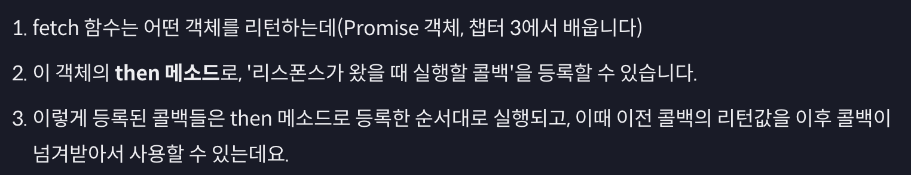

# 자바스크립트 웹 개발 기본기

### fetch 함수

```jsx
fetch("https://www.google.com")
  .then((response) => response.text())
  // response를 처리하는 함수
  .then((result) => {
    console.log(result);
  });
//
```

- `fetch`: 서버로 요청을 보내고 응답을 받는 함수

`then` 메소드: 콜백을 등록함 → 앞선 콜백이 완료되어야 함. 그 콜백의 리턴값이 다음 콜백의 인자로 들어감.



1. `fetch` 함수는 `**Promise**` 객체를 리턴함.
2. `**then**` 메소드를 통해, 응답이 왔을 때 실행할 콜백을 등록함.
3. 콜백은 `then` 메소드를 등록한 순서대로 실행됨. 이전 콜백의 리턴값을 넘겨받아 사용할 수도.

- 개발자 도구 단축키: `command+option+i`

### JSON

- JSON 데이터
  - 응답으로 받아온 JSON 데이터는 string 타입.
  ```jsx
  JSON.parse(text); // 문자열을 JSON 객체로 반환함.
  ```
- 프로퍼티의 이름과 값을 표현하는 방식
  - 프로퍼티 이름: 반드시 큰따옴표(`””`)로 감싸야 함.
  - 값이 문자열인 경우 반드시 큰따옴표(`””`)로 감싸야 함.
- 기타 참고사항
  - 표현할 수 없는 값들이 존재함. (`undefined`, `NaN`, `Infinity` 등 자바스크립트에서만 유효한 값)
  - 주석을 추가할 수 없음.

**JSON 데이터 다루기**

- string 타입의 JSON 데이터를 자바스크립트 객체로 변환 → **`Deserialization`**
- json 메소드: `JSON.parse()`를 하지 않아도 바로 자바스크립트 객체로 사용 가능.

### HTTP 메소드


### POST method

`fetch` 함수 뒤에 새로운 인자가 들어감. → 옵션 객체

아무런 옵션 객체 없이 전달하면 기본적으로 **`GET method`**

```jsx
fetch("./api", {
  method: "POST",
  body: JSON.stringify($new),
})
  .then((response) => response.text())
  .then((result) => {
    console.log(result);
  });
```

`parse`: 문자열을 JSON 타입으로 바꿔줌.

`stringify`: JSON을 문자열로 바꿔줌.

### PUT, DELETE method

`**PUT**`은 fetch를 특정 위치에 있는 데이터로 접근하여, 해당 위치의 데이터값을 모두 변경함.

**`DELETE`**는 해당 위치의 데이터를 없앰. `body` 속성이 존재하지 않음.

### Status Code

[Status Code 더 자세히 - 자바스크립트 웹 개발 기본기 | 코드잇](https://www.codeit.kr/topics/basics-of-js-web-dev/lessons/4358)

### 기타

- `Content-type`: 헤더. 주 타입/서브 타입의 형식으로 나타남. 리퀘스트나 리스폰스의 바디에 들어있는 데이터의 타입을 나타내기 위해 사용하는 헤더.

`**Ajax**`: **Asynchronous JavaScript And XML**

- 자바스크립트를 사용해서 비동기적으로 리퀘스트를 보내고 리스폰스를 받는데 기반이 되는 기술들의 집합.
  - Ajax 통신. XMLHttpRequest 객체. 개발 실무에서는 fetch 함수 또는 axios 패키지를 사용함.
- **PUT과 PATCH의 차이**: PUT은 기존 데이터를 아예 새로운 데이터로 덮어씀으로써 수정하려고 할 때 쓰는 메소드. PATCH는 새 데이터로 기존 데이터의 일부를 수정하려고 할 때 쓰는 메소드.

---

# 비동기 실행

`.then` 메소드: 서버로부터 응답/앞 콜백의 리턴을 받았을때 콜백 함수를 실행. → 콜백을 일단 등록만 함 → 그다음 코드를 실행하므로 순서가 꼬임.

- `**setTimeOut()**` 함수: 특정 함수의 실행을 원하는 만큼 미룰 수 있음.

```jsx
setTimeOut($callback, $time); // 시간의 단위는 ms, **1000ms = 1s**
```

- `**setInterval()**` 함수: 일정한 시간 간격으로 실행하도록 하는 함수.

## Promise 객체

`fetch` 함수가 `**Promise**` 객체를 반환함. _어떤 작업에 관한 상태 정보를 갖고 있는 객체_

- 프로미스 객체의 상태


`fulfulled` 상태라면 작업 성공 결과를, `rejected` 상태라면 작업 실패 정보를 갖게 됨.

### Promise Chaining

`then` 메소드는 새로운 `Promise` 객체를 리턴함.

일반 객체를 리턴할 경우 다음 then`이` `fulfilled`가 됨. 어떤 값을 리턴하냐에 따라 다름. `Promise`를 리턴하면 해당 값에 따라 달라짐.

콜백 안에 `then` 메소드를 쓰지 않고 코드를 짤 수 있음. 비동기적으로 순차적으로 처리하기 위해 Promise Chaining을 함.

[then 메소드 완벽하게 이해하기 - 자바스크립트 웹 개발 기본기 | 코드잇](https://www.codeit.kr/topics/basics-of-js-web-dev/lessons/4374)

- `**then**` 메소드
  **Case(1) : 콜백에서 Promise 객체를 리턴**
  콜백이 리턴한 Promise 객체를 B라고 하면 A는 B와 동일한 상태와 결과를 갖게 됩니다. 나중에 B가 fulfilled 상태가 되면 A도 똑같이 fulfilled 상태가 되고 동일한 작업 성공 결과를, 나중에 B가 rejected 상태가 되면 A도 똑같이 rejected 상태가 되고 동일한 작업 실패 정보를 가진다는 뜻입니다.
  **Case(2) : 콜백에서 Promise 객체가 아닌 일반적인 값을 리턴**
  A는 fulfilled 상태가 되고, 해당 리턴값을 작업 성공 결과로 갖게 됩니다.
  **Case(3) : 콜백에서 아무것도 리턴하지 않음**
  자바스크립트에서는 함수가 아무것도 리턴하지 않으면 undefined를 리턴한 것으로 간주합니다.
  따라서 A는 fulfilled 상태가 되고, undefined를 작업 성공 결과로 갖게 됩니다.
  **Case(4) : 콜백 실행 중 에러 발생**
  A는 rejected 상태가 되고, 해당 에러 객체를 작업 실패 정보로 갖게 됩니다.
  **Case(5) : 콜백이 실행되지 않음**
  A는 호출된 `then` 메소드의 주인에 해당하는, 이전 Promise 객체와 동일한 상태와 결과를 가집니다.
  Promise 객체 공부는 `then` 메소드가 그 처음과 끝이라고 해도 될 정도로, `then` 메소드를 정확하게 이해하는 것이 중요합니다. 지금 각각의 케이스를 잘 기억해 두면, 앞으로의 내용을 훨씬 더 쉽게 이해할 수 있을 겁니다.

→ 아무것도 리턴하지 않아도 `undefined`를 리턴한 것으로 봐서 `fulfilled` 상태가 됨.

⇒ `Promise` 객체는 굳이 없어도 되는데 왜 만들어졌는가? `**callback hell**`을 방지하기 위해.

- Promise chaining 순서

(1) 각 비동기 작업을 순차적으로 처리하기 위해서 실행할 콜백들을

```
then
```

메소드들로 앞에서 설정한다.
(2)

```
catch
```

메소드를 사용한다. (Error 발생으로 인해 어느 Promise 객체가 rejected 상태가 되더라도 대응)
(3)

```
finally
```

메소드를 사용한다. (전체 작업이 성공하거나 중간에 실패하거나, 심지어

```
catch
```

메소드의 콜백에서 에러가 발생하는 경우에도 항상 실행해야 할 콜백을 등록)

- rejected 상태일 때는 어떻게 실행할까?

`then` 메소드에 콜백 함수를 2개 넣어주자. → 두 번째 콜백함수가 `rejected`일 때 실행됨.

해당 콜백함수에는 **작업 실패 정보**가 인자로 들어감.

⇒ `**catch**` 메소드 사용

- `.catch` 메소드를 사용하여 rejected되었을 때 어떤 작업을 실행할지 결정함.
- `then` 메소드를 이용한 것과 크게 다르지 않음. `then` 메소드 첫 인자에 `undefined`가 들어간 것과 같은 역할.
- `catch` 메소드를 가장 마지막에 적어야 오류가 발생할 가능성이 낮음.

- **`finally`**: 성공 실패에 상관없이 돌아갈 코드. `catch` 메소드 바로 뒤에 씀.

```jsx
fetch("./api")
  .then((response) => response.text())
  .then((result) => {
    console.log(result);
  })
  .then((error) => {
    console.log(error);
  })
  .then(() => {
    console.log();
  });
```

일반 객체 만들듯이 new를 활용하여 만들고, 인자로 성공했을 때와 실패했을 때의 콜백함수를 전달함.

---

# await, async

`**await**`은 해당 작업이 끝날 때까지 유지함. `fulfilled`나 `rejected`될 때까지 기다림.

→ `**async**` 앞에서만 사용 가능함.

코드가 보이는 순서대로 진행되는 것이 아닌, 함수 밖으로 나가서 다른 애들 먼저 수행함 → `await`이 `fulfilled`가 될 때까지.

⇒ `try catch finaly`구문을 통해 오류 처리할 수 있음.

- `async` 함수는 항상 `Promise` 객체를 반환함. → 다른 값을 리턴하면 그 값을 가진 `fulfilled` 상태의 `Promise` 객체를 반환함.
- `await`을 이용하여 `async` 중첩이 가능함.

- `async/await` 구문: 기존 `Promise` 코드를 **(1) 개발자가 더 편하게 작성할 수 있도록 하고 (2) 코드의 가독성을 높이기 위해 사용하는** 문법적 장치

> `async`가 앞에 붙은 함수는 그 안에 비동기적으로 실행될 내용이 있다는 뜻이고, 그 부분은 바로 함수 내부에서 `await`이 붙은 부분입니다.
> `async` 함수 안의`await`은 그 뒤의 코드를 실행해놓고, 코드의 실행 흐름을 함수가 호출된 외부로 바꿉니다.
> 외부의 코드를 모두 실행하고 나서는 `await` 뒤의 `Promise` 객체의 상태가 fulfilled 상태가 될 때까지 기다렸다가(또는 이미 fulfilled 상태가 된 Promise 객체에 대해서) 그 작업 성공 결과를 추출해서 리턴해요.

```jsx
// 1) Function Declaration
async function example1(a, b) {
  return a + b;
}

// 2-1) Function Expression(Named)
const example2_1 = async function add(a, b) {
  return a + b;
};

// 2-2) Function Expression(Anonymous)
const example2_2 = async function (a, b) {
  return a + b;
};

// 3-1) Arrow Function
const example3_1 = async (a, b) => {
  return a + b;
};

// 3-2) Arrow Function(shortened)
const example3_2 = async (a, b) => a + b;
```
