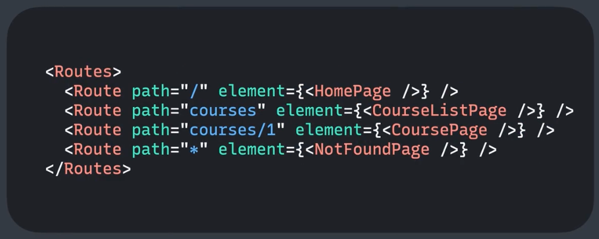

# React로 웹사이트 만들기

프로그램: 프로젝트 트랙
플랫폼: 코드잇
기간: 2023년 12월 19일 → 2024년 1월 2일

# React Router

- **`App.module.css`**: 컴포넌트에서 클래스명을 객체로 가져와서 사용할 수 있는 CSS 방식.

: 리액트 컴포넌트로 페이지를 나누는 라이브러리

핵심 컴포넌트: `Router`, `Routes`, `Route`, `Link`



페이지를 나눌 때


페이지를 이동할 때

**Router**: 리액트 라우터에서 사용하는 데이터들을 모두 갖고 있음. (현재 주소나 페이지 기록같은 데이터를 갖고 있음.)

→ 없으면 리액트 라우터 사용 불가. 라우터 컴포넌트 안에서 사용해야 함.

<aside>
 **`ContextAPI`**

---

Props를 거치지 않고 데이터를 넘겨줌.

- Context Provider: 데이터를 적용할 범위를 지정함.
</aside>

`**Routes**`, **Route**: 둘이 보통 함께 사용함. switch문처럼 사용하며, 하나씩 대조하다가 일치하는 Route에 있는 컴포넌트를 보여줌.

`**Link**`: 리액트 라우터에서 `a태그` 대신하여 사용함.

> **주의**: react-router 패키지가 아닌 `**react-router-dom**`을 임포트하여 사용해야 함.

```bash
yarn add react-router-dom
```

---

### Routes로 페이지 나누기

- main.js 파일에서 App 컴포넌트를 먼저 BrowserRouter로 감싸고 시작함.
  - App 컴포넌트 안을 Routes와 Route로 채움.

**→ 각 Route에 속성으로 path, element가 있음**

- path는 단순히 경로를 지정함. element는 보여줄 컴포넌트를 **`jsx형태`**로 넘겨줌.

### Link

`**to**` 속성을 통해 이동할 경로를 추가할 수 있음 (a태그처럼 사용함.)

- `**/**`를 맨 앞에 붙일 경우 절대 경로로 작동함. → [localhost:3000](http://localhost:3000) 뒤에 자동으로 붙음.
- 상대 경로의 경우는 현재 주소 뒤에 붙여줌.

### NavLink

링크와 비슷하지만, style로 함수를 지정해줄 수 있음.

→ 함수의 파라미터: 객체(isBoolean 등)

이를 통해 인라인 스타일을 지정해줄 수 있음.

---

- Route를 중첩으로 사용하여 path를 간결하게 바꿔줄 수 있음.
- Routes 안에는 반드시 Route 친구들만 있을 수 있음. App 컴포넌트는 배치할 수 없음.
  - Outlet 컴포넌트를 통해 App을 Route의 속성으로 넘겨줄 수 있음.
  - 기존 / 를 path로 갖던 부분을 위로 올려 App을 속성으로 받게 하고, 그 아래 index 속성을 갖는 Route를 추가해줌.
  - → App에 Props로 전달되던 부분을 없애고, 해당 부분에 Outlet 컴포넌트를 넣어줌.
  - ⇒ Route 안에서 렌더링되는 부분은 Outlet에서 렌더링됨. → **공통 레이아웃**이 보이도록 할 수 있음.


---

## useParams

동적 경로.

**`:`** 을 통해 뒤에 변수로 페이지의 경로를 받아올 수 있음. → 파라미터

- **`useParams`**는 해당 페이지에 작성하는데, 이 객체 안에는 현재 경로의 파라미터들이 저장됨.

---

- 없는 주소 처리하는 방법

```jsx
<Route path="*" element={<NotFoundPage>}>
```

이 코드를 맨 아래 추가해주면, 위에서 한번도 안걸러진 모든 경로를 포함할 수 있음.

### 리다이렉트

```jsx
<Navigate to="/">
```

네비게이트 컴포넌트를 페이지에 사용하여, 특정 상황에 다른 페이지로 리다이렉트할 수 있도록 함.

### useSearchParams

쿼리를 사용하기 위해 존재함.


검색창 예시

```jsx
const [searchParams, setSearchParams] = useSearchParams();
```

해당 객체에서는 get 메소드를 통해 해당 쿼리의 값을 가져올 수 있음.

**→ 쿼리 스트링을 구현하는 방법**

- form 태그에서 onSubmit이라는 프롭을 구현하면 됨.
  - 이벤트 객체를 받자마자 preventDefault를 통해 페이지 이동을 리액트 라우터에서 하도록 강제함.
  - setSearchParams 함수에서 파라미터로 객체를 전달함. 이를 통해 쿼리 값을 지정할 수 있음.

---

- **`useNavigate`**를 통해 \*\*\*\*이동할 경로를 지정해줄 수 있음.

## 싱글 페이지 애플리케이션 (SPA)

클라이언트사이드 렌더링: 웹 브라우저에서 JS로 HTML 코드를 만들어냄.

**하나의 HTML** 내에서 자바스크립트를 이용해 **여러 페이지**를 보여줌.
